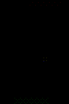
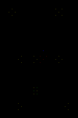
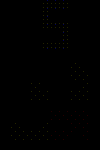
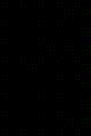
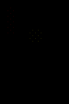
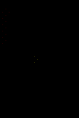
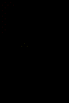

# FasiBoi-Color
This project was done together with with [@jgygax](https://github.com/jgygax) to run on our costume at Lucerne Carneval 2023.

This repository contains the software for a Game-Boy inspired console, that runs on a 10x15 pixel home made LED grid, which is incorporated into our costume as a playable game boy costume. It features many games, music visualization and other applications.

## Installation
The best way of running it by yourself is through [Docker](https://docs.docker.com/get-docker/):

1. Install Docker
2. Open a Terminal (Powershell on Windows)
3. Run:
    ```bash
    docker run -it -p 8000:8000 -p 8001:8001 pascscha/fasiboi
    ```

## Controls
The physical version comes with a controller with 7 buttons. These are mapped onto the keyboard when running the Docker version:

| Control | Mapping | Functionality           |
| :------ | :------ | :---------------------- |
| Back    | `Esc`   | Back / Close            |
| A       | `A`     | Select / Primary Button |
| B       | `B`     | Secondary Button        |
| Up      | `↑`     | Go / Scroll Up          |
| Down    | `↓`     | Go / Scroll Down        |
| Left    | `←`     | Go Left                 |
| Right   | `→`     | Go Right                |

## Menu Navigation
When it starts you will see the main Menu. From there you can navigate all possible applications. The full application name scrolls by when you stay on one application.

## Games
Games can be found at `Applications -> Games` in the menu. Most games open with a screen showing the current highscore and if you just played the game, the last previous score. Press `A` to start the game.

### Snake


Eat as many red dots as possible. If you collide with yourself you loose. If you go out of the playing board you will re-enter on the other side.

| Control | Functionality |
| :------ | :------------ |
| Up      | Move Up       |
| Down    | Move Down     |
| Left    | Move Left     |
| Right   | Move Right    |

### Tetris


Place as many tiles on the board without filling it up to the top. You can rotate pieces to better fit your existing tiles. Once you fill a row completely, it will disappear. Making multiple rows disappear at the same time gives more points.

| Control | Functionality     |
| :------ | :---------------- |
| A       | Rotate the Piece  |
| Left    | Move Piece Left   |
| Right   | Move Piece Right  |
| Down    | Drop Piece Faster |

### Flappy Bird


Fly through the tubes without crashing into them. You move forward automatically and will get an upward boost when you flap your wings

| Control | Functionality      |
| :------ | :----------------- |
| A       | Flap Wings (Go Up) |

### Racer


Switch lanes to avoid obstacles. Get as far as possible without the time (green bar) running out and without crashing into anything.

| Control | Functionality             |
| :------ | :------------------------ |
| Up      | Move forward on same lane |
| Left    | Move left and forward     |
| Right   | Move right and forward    |


### Pong


Play Pong against the machine. Avoid the ball getting past your green paddle by steering it left and right. But careful, your paddle shrinks over time and the ball gets faster and faster.

| Control | Functionality     |
| :------ | :---------------- |
| Left    | Move paddle left  |
| Right   | Move paddle right |

### Pacman


Collect all the dots without being caught by the colored ghosts. If you manage to eat a bright dot, the ghosts will be scared of you for a while and you can eat them for extra points.

_By the way, the ghosts follow the same movement logic and have the same "personalities as int the original_

| Control | Functionality             |
| :------ | :------------------------ |
| Up      | Change direction to up    |
| Down    | Change direction to down  |
| Left    | Change direction to left  |
| Right   | Change direction to right |


### 2048


Stack tiles. Every turn you can slide all tiles to one direction. If two tiles of the same color collide, they merge and form a tile with higher value. Afterwards a new tile will appear at a random free location. Try to merge tiles as long as possible before the board completely fills up.

| Control | Functionality     |
| :------ | :---------------- |
| Up      | Shift tiles up    |
| Down    | Shift tiles down  |
| Left    | Shift tiles left  |
| Right   | Shift tiles right |

### Maze


Solve the Maze as quickly as possible by getting the red dot from the top to the bottom.

| Control | Functionality |
| :------ | :------------ |
| Up      | Move up       |
| Down    | Move down     |
| Left    | Move left     |
| Right   | Move right    |

### Super Mario


Collect as many points as possible and save the princess! Avoid the green goombas and don't fall into the void. Collect yellow boxes for extra points and a power up by jumping int to them from below.

| Control | Functionality |
| :------ | :------------ |
| Up      | Jump          |
| Left    | Move left     |
| Right   | Move right    |


### Strategy Games
There are several strategy games that you can play against a friend or the computer. These games come with an extra menu where you can choose who will play against whom. To play against a friend just select "Human Player" for both red and blue players. There are also Computer players with different difficulty settings. Can you beat the hardest difficulty?

| Control | Functionality                        |
| :------ | :----------------------------------- |
| A       | Place Marker at highlighted position |
| Up      | Move highlight up                    |
| Down    | Move highlight down                  |
| Left    | Move highlight left                  |
| Right   | Move highlight right                 |

#### Tic Tac Toe


Play Tic Tac Toe (Noughts & Crosses) against a friend or the computer. Try to get 3 in a row to win the game.

#### Connect 4


Play Connect 4 against a friend or the computer. Try to get 4 in a row to win the game. You can only place your markers at the bottom of each column.

#### Reversi


Play Reversi against a friend or the computer. Try to fill the board as much as possible with your color. You can only place markers if they enclose at least one other marker of your opponent between your newly placed marker and an existing marker of your color (vertical horizontal or diagonal). You can read about the full rules on [Wikipedia](https://en.wikipedia.org/wiki/Reversi#Rules).
