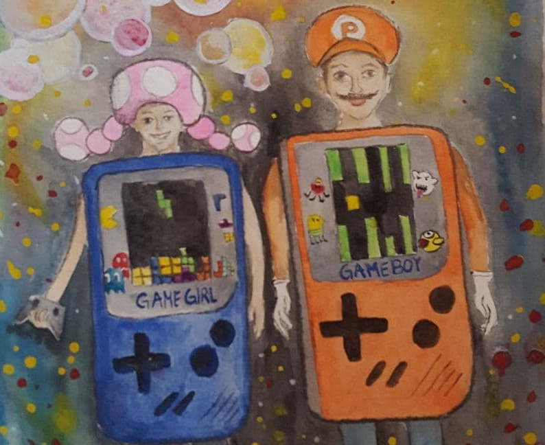
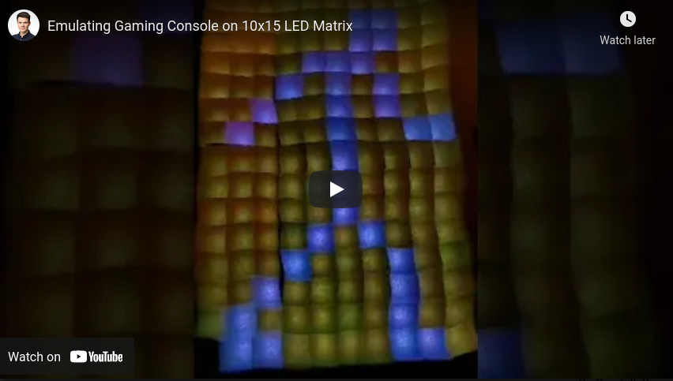

# FasiBoi-Color [WIP]
This is the Work in Progress repository for a carneval costume, due to be used in February 2022.

## Vision

## Showcase

This shows the first time we managed to run the software on a prototype of the physical LED display.

## Helligkeiten
- 1
  - 0.65 A
  - Sehr gut sichtbar

- 0.5 
  - 0.4 A
  - Betz weniger aber au okay so

- 0.25
  - 0.25A 
  - Scho halbiert?

- 0.125
  - 0.18A
  - Scho betzli dönkler, Wenns fiister esch doss gsesch das locker

- 1/16
  - 0.15A
  - Gsesch scho dass es nömme s ganze fäldli so ganz mag fölle

- 1/32
  - 0.124A
  - Wie bem 16tel

- 1/64
  - 0.12 a
  - Das wöri jetzt aber ned näh

# [Ideas](http://inventwithpython.com/blog/2012/02/20/i-need-practice-programming-49-ideas-for-game-clones-to-code/):
## Simon
Description: Four colored buttons light up in a specific pattern. After displaying the pattern, the player must repeat the pattern by clicking the buttons in proper order. The pattern gets longer each time the player completes the pattern. If the player presses a wrong button, the game ends.

## Flood It
A grid of six colors of tiles starts off randomly. The player can do a "flood fill" on the top left tile, changing the color of any adjacent tiles of the same color. The player wins if they are able to make the entire board a single color within a certain number of moves.

## Candy Crush
The board is filled with seven different types of jewels. The player can swap two adjacent jewels to form a three-in-a-row, causing the jewels to disappear and the jewels on top of them to fall down. Creating chain reactions gives bonus points.

## Grid Lock
The player must slide a target car through an exit, but other cars are blocking the way. Cars can only be moved vertically or horizontally depending on their starting orientation. Level designs can be copied from existing games.

## Space Invaders
A few rows of enemies gradually makes they're way down to the player. The player must shoot them all before they reach the bottom. 

## Tron
Players control a constantly moving object that leaves a trail of walls behind it. The player who avoids crashing into a wall longest wins.

## Snood / Bust-a-Move
The top of the board is filled with different colored bubbles. The player must shoot bubbles from the bottom to form a set of three bubbles of the same color in a row to make them disappear. The ceiling lowers over time. The player wins if the board is cleared of bubbles, and loses if the bubbles reach the bottom.