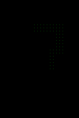
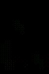

# FasiBoi-Color
This project was done together with with [@jgygax](https://github.com/jgygax) to run on our costume at Lucerne Carneval 2023.

This repository contains the software for a Game-Boy inspired console, that runs on a 10x15 pixel home made LED grid, which is incorporated into our costume as a playable game boy costume. It features many games, music visualization and other applications.

## Installation
The best way of running it by yourself is through [Docker](https://docs.docker.com/get-docker/):

1. Install Docker
2. Open a Terminal (Powershell on Windows)
3. Run:
    ```bash
    docker run -it -p 8000:8000 -p 8001:8001 pascscha/fasiboi
    ```

## Controls
The physical version comes with a controller with 7 buttons. These are mapped onto the keyboard when running the Docker version:

| Control | Mapping | Functionality           |
| :------ | :------ | :---------------------- |
| Back    | `Esc`   | Back / Close            |
| A       | `A`     | Select / Primary Button |
| B       | `B`     | Secondary Button        |
| Up      | `↑`     | Go / Scroll Up          |
| Down    | `↓`     | Go / Scroll Down        |
| Left    | `←`     | Go Left                 |
| Right   | `→`     | Go Right                |

## Menu Navigation
At start you will see the main Menu. From there you can navigate all possible applications. The full application name scrolls by when you stay on one application.

## Games
Games can be found at `Applications -> Games` in the menu. Most games open with a screen showing the current highscore and if you just played the game, the last previous score. Press `A` to start the game.

### Snake


Eat as many red dots as possible. If you collide with yourself you loose. If you go out of the playing board you will re-enter on the other side.

| Control | Functionality |
| :------ | :------------ |
| Up      | Move Up       |
| Down    | Move Down     |
| Left    | Move Left     |
| Right   | Move Right    |

### Tetris


Place as many tiles on the board without filling it up to the top. You can rotate pieces to better fit your existing tiles. Once you fill a row completely, it will disappear. Making multiple rows disappear at the same time gives more points.

| Control | Functionality     |
| :------ | :---------------- |
| A       | Rotate the Piece  |
| Left    | Move Piece Left   |
| Right   | Move Piece Right  |
| Down    | Drop Piece Faster |

### Flappy Bird


Fly through the tubes without crashing into them. You move forward automatically and will get an upward boost when you flap your wings

| Control | Functionality      |
| :------ | :----------------- |
| A       | Flap Wings (Go Up) |

